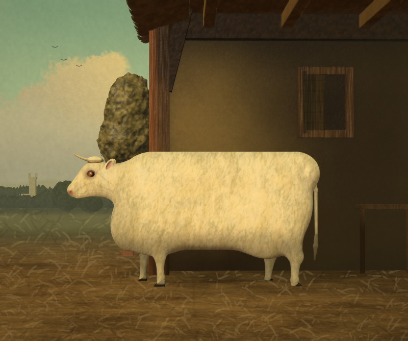

# Brother Troubled

A rebuild of *Ivory Pastoral* as a truer copy of the source painting: an ivory fat-stock cow standing in the
open bay of a dark thatched barn, viewed from **inside** the barn. Still a Shadertoy multipass shader,
still real 3D SDF geometry, still mouse-orbitable (+/-15 degrees), no textures or external assets.

Before (hand-off) / after: `baseline/portrait.png` vs `shots/final.png`. Orbit extremes: `shots/orbit-left.png`, `shots/orbit-right.png`.

## What changed from the hand-off

**Cow** (authored in painting pixels via `P(px,py,z)` / `PX(n)` in `Common.glsl`, so it can be checked against the picture)
- Barrel: the painting's silhouette as a per-corner rounded 2D box, inflated into a soft slab, plus haunch, shoulder and brisket swells. Back, rump and belly outlines were measured against the painting (within ~3 px).
- Horns: smooth bent tubes (`arcTaper`, a tapering arc with a spherical tip) growing out of a poll boss. No straight segments.
- Ears: leaf ellipsoids sunk into the skull and blended with a small radius (previously floating). Cream rim, pinker cupped inside.
- Tail: root buried in the rump, rope hanging down the rear edge, tapering switch (previously detached).
- Eye: socket, proud eyeball, dark pigmented orbit, amber iris, slit pupil, geometric catchlight. Muzzle with nostril and mouth line.
- Legs: slender, with knee/hock/fetlock/pastern, staggered near/far stance, wedge hooves with a cleft. The old y-remapping hack is gone; everything is in true world units.

**Barn**: rebuilt as an interior. Roof and thatch eave overhead, rafters, tie beam, recessed back wall, a bay post with a flush knee brace, daylight only through the open bay (left), a framed hatch with its leaf swung ~15 degrees open, bench, straw floor.

**Landscape and sky**: calibrated camera (horizon, hoof and ground perspective match the painting); crown-row tree lines, church tower, elm with trunk, meadow strip, teal sky with a warm cumulus and three birds. The sky follows only a quarter of the orbit, like a backdrop.

**Colour and finish**: palettes are written in sRGB as read off the painting; tone curve is near-identity with a soft knee; hide gets canvas-anchored bristle strokes, ground gets straw dabs, stronger vignette.

Palette check against the painting (`tools/regions.py`, 33 regions): mean abs RGB error 0.086 (hand-off) -> 0.036.

## Files

| | |
|---|---|
| `BrotherTroubled.json` | Shadertoy export (Common, Buffers A-D, Image). Same pass/channel wiring as the hand-off |
| `viewer.html` | Standalone WebGL2 viewer with the shader embedded |
| `src/` | Editable GLSL and `project.json` manifest |
| `tools/build.mjs` | `node tools/build.mjs` rebuilds the JSON and viewer from `src/` |
| `tools/render.mjs` | Headless SwiftShader capture (`--drag X Y`, `--dbl`, `--frames`) |
| `tools/test.mjs` | Acceptance tests: finite buffers, orbit clamps, double-click reset (`tests/report.json`) |
| `tools/compare.py`, `regions.py`, `edges.py`, `slice.mjs`, `cam.py` | Study aids: side-by-side/edge overlay, palette table, silhouette edges, SDF slices, camera calibration |

`regions.py`/`edges.py` read the source painting from `BT_REFERENCE` (default `reference/painting.jpg`); the painting is not shipped.

## Tuning

`Common.glsl`: `PAINT_AMOUNT`, `EXPOSURE`, `COW_STEPS`, `SHADOW_STEPS`, `ORBIT_LIMIT`, camera constants `CAM_D/CAM_YAW/CAM_PITCH`.

## Limits

Verified only on software rendering (Chromium + SwiftShader): all passes compile, all buffers finite at 800x668/16 frames, orbit clamps and reset probes pass. Native GPU performance and Windows ANGLE/D3D11 compile time were not measured. Remaining known gaps versus the painting: the hide reads slightly woolier and more saturated than the oil, the sky is less dramatic, and the foreground straw is more regular than the painted wisps.
