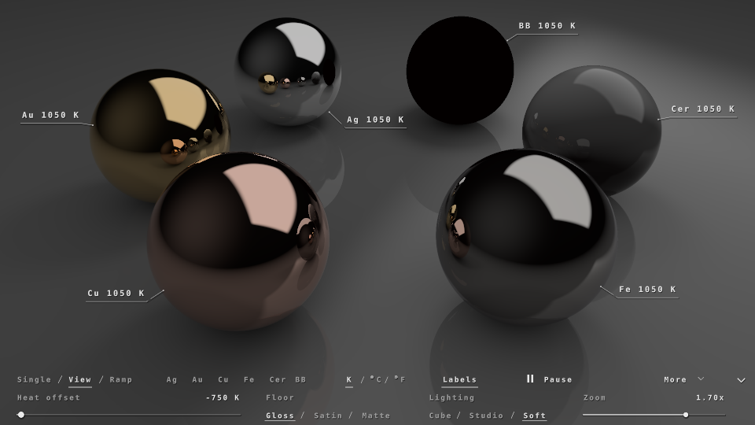
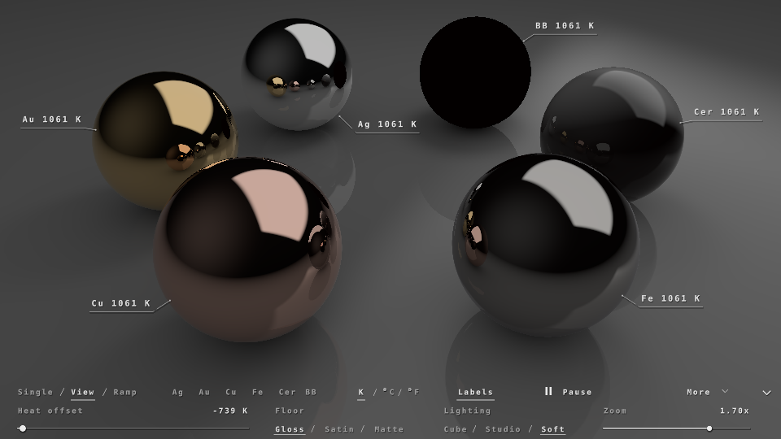
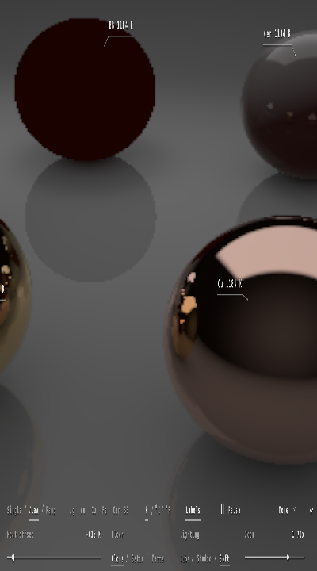

# Thermal Spectral Lab (Lite)

A mobile-friendly build of *Thermal Spectral Lab — Radiant Transport*
(`reference/Thermal_Spectral_Lab_Polished_24.json`). It looks almost the same as the original
and does a small fraction of the work per frame. The full-quality transport is still one
`#define` away.

Paste `ThermalSpectralLab.json` into Shadertoy (same channels, textures and passes as the
original), or open `viewer.html` locally.

| original (full transport) | lite transport, full resolution | lite, 400×720 portrait |
|---|---|---|
|  |  |  |

## Settings (top of Common)

```glsl
#define QUALITY 0        // 0 = lite (default), 1 = original transport
#define RENDER_SCALE 0.0 // 0 = adaptive; e.g. 1.0 = fixed full resolution
#define MIN_SCALE 0.35
#define MAX_SCALE 1.0
```

## What changed

**It now runs on small canvases.** The original kept its lookup tables and all per-frame
state at x = 768…785 in every buffer, and its emission table was 768 px wide. On a canvas
narrower than 786 px (a small window, the embedded preview at DPR 1, some phones) those
texels do not exist, so the shader stays on "Loading" forever. From the outside that looks
like a compile failure. The tables are now 64(T)×32(μ) tiles packed into 192×68, and the
state block starts at x = 192, so any canvas of at least 211×68 px works.

**Buffer B (the path tracer), `QUALITY 0`:**
- 1 ray per pixel instead of 4 (no jitter).
- Path depth 3 instead of 4, which still gives sphere-in-sphere reflections.
- 1 ambient direction instead of 3.
- Soft shadows only on the directly visible surface. Reflected surfaces get the same sphere
  and lamp lighting, just unshadowed.
- The soft-shadow disk overlap uses small-angle sines and a smoothstep ramp instead of
  `asin`/`atan`/2×`acos` for each occluder and each light.

**Adaptive resolution.** B, C and D draw the scene into the lower-left
`scale × resolution` block, and Image upsamples it bilinearly. Buffer A tracks a smoothed
frame time. Below ~25 fps the scale drops by ×0.8; above ~45 fps it rises by ×1.12, with at
least 0.75 s between steps. A phone locked to 30 fps by vsync is left alone. The scale starts
at 0.5, so desktops climb to 1.0 within a few seconds. The UI and text are always drawn at
full resolution.

**Bloom:** 13 taps instead of 33 per direction, with the tap stride scaled so the Gaussian
stays 6 screen px wide. It also only runs inside the scaled block.

**Spectral data:** 10 nm sampling (48 samples) instead of 5 nm (95), each weighted ×2 so
the radiance units are unchanged. Emitted Y changes by less than 0.1% and D65 reflectance by
less than 0.07%. The constant arrays shrink from 475 entries to 144 `vec4`s (n,k packed two
wavelengths per `vec4`), which is easier on mobile shader compilers.

**Image:** a cheap bounding-box test skips the label leader and mask loops for pixels far
from every label. The output is pixel-identical.

**Text that survives low-precision GPUs.** The original packed four characters into each
32-bit `uint` literal. It also sent label and readout text from Buffer C to Image as 16-bit
halves stored in float buffers. On GPUs with 16-bit or float-emulated integers, or with
half-float buffers, anything over 2–3 characters came out scrambled. Short strings like
`Au`, `Fe`, `K` and `°C` still worked. Text is now one character code per `ivec4` component
(max 12). Image builds the live labels and readouts itself from the state row, so nothing
textual goes through a buffer. The `iFrame` arithmetic in the label placer is also kept
small. The rendered result is pixel-identical on a full-precision GPU.

**Smaller fixes:**
- Passes that own nothing at a pixel exit early.
- A local `digits` variable no longer shadows the `digits()` function in C.

## Measurements

These come from headless Chromium on SwiftShader (a CPU rasteriser), at 960×540 with the
default Soft/Gloss scene:

| build | Buffer B | whole frame |
|---|---|---|
| original | 1139 ms | 1575 ms |
| `QUALITY 1`, scale 1.0 | 1139 ms | 1565 ms |
| lite, scale 1.0 | 184 ms | 494 ms |
| lite, scale 0.5 | 63 ms | 378 ms |
| lite, scale 0.35 | 49 ms | 350 ms |

At this size SwiftShader spends about 50–60 ms on every pass even when the pass exits on its
first line (see Buffer A), so the savings on a real GPU are larger than this table shows.

`QUALITY 1` at scale 1.0 matches the original to within 4/255 per channel.

## Files

- `src/*.glsl`: pass sources. `src/description.txt` is the Shadertoy description.
- `tools/build.mjs`: `node tools/build.mjs` writes `ThermalSpectralLab.json` and
  `viewer.html`. Pass wiring is copied from the reference export.
- `tools/bench.mjs`: `node tools/bench.mjs --passes 1 [--def QUALITY=1,RENDER_SCALE=1.0]
  [--json other.json] [--keys 77,72] [--shot out.png]` runs a headless compile, timing and
  screenshot.
- `tools/viewer_template.html`: a small Shadertoy runtime (keyboard, stand-in cubemap and
  font atlas). The Studio/Soft lights are procedural; the Cube light uses a stand-in sky
  offline.
