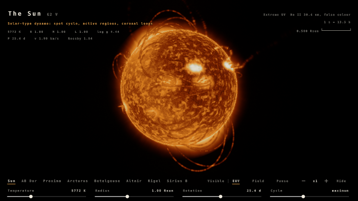
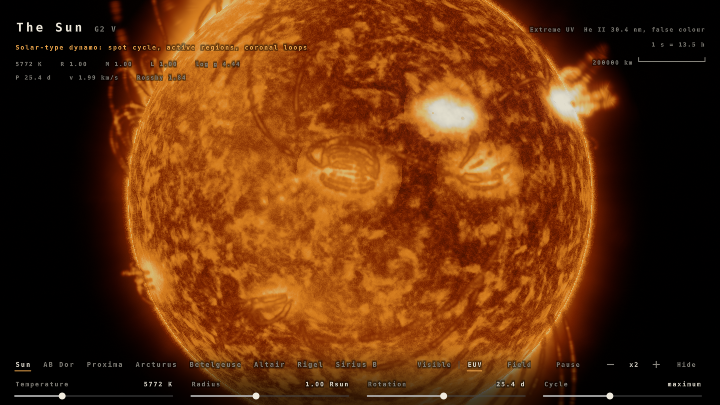
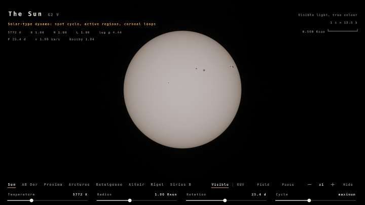
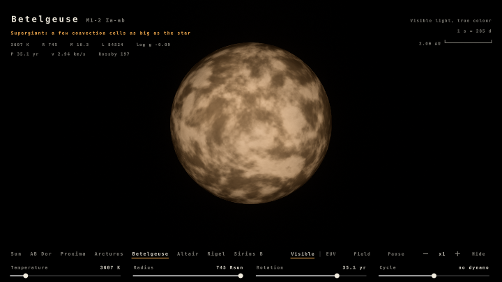
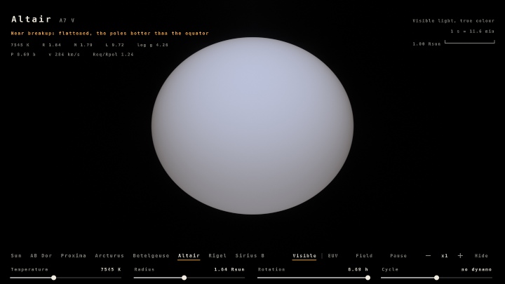
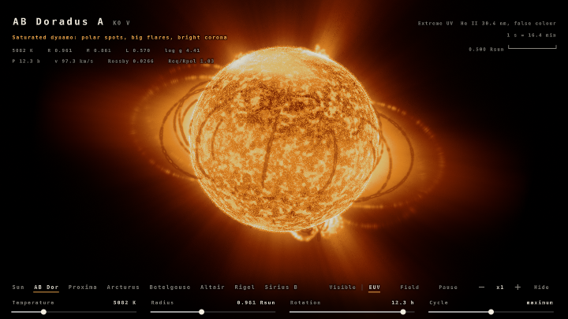
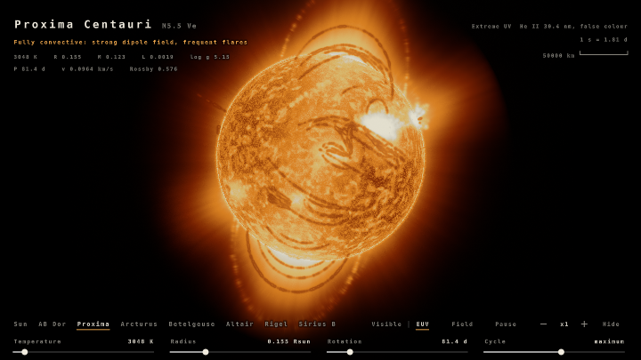
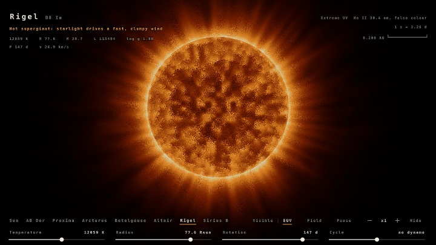

# Helios: Star Lab

Eight real stars from one physical model. Every visible difference between them comes from
five numbers: **temperature, radius, mass, rotation and magnetic-cycle phase**. There are no
per-star special cases, so the sliders always mean something: drag the Sun's temperature past
7000 K and its granulation, spots and field vanish; spin it up and it flattens, gravity-darkens
and becomes a saturated, polar-spotted flare star; inflate it and its granules grow into a few
supergiant convection cells.

**Stars:** Sun, AB Doradus A, Proxima Centauri, Arcturus, Betelgeuse, Altair, Rigel, Sirius B.

 
 
 
 

## Controls

- **Star names** (bottom row): pick a star. Click the selected one again to undo slider changes.
- **Temperature / Radius / Rotation / Cycle**: the orange tick marks the real star's value.
  Rotation is a fraction of breakup speed; the readout is the period that implies.
- **Visible / EUV**: true colour, or He II 30.4 nm-style extreme ultraviolet (false colour; the default).
- **Field**: overlay the traced field lines (warm: closed loops; magenta/blue: open field by polarity).
- **Pause**, **- x1 +** zoom (to x64, enough to resolve solar granulation), **Hide** the interface.
- **Drag** anywhere else to orbit.

The top-left line says, in words, what regime the current parameters put the star in.

## What is modelled

- **Colour**: a CIE 1931 / Planck table (Buffer A). Each surface point emits a blackbody at the
  temperature found at optical depth tau = mu in a grey Eddington atmosphere, so limb darkening
  and limb reddening come out right for a red supergiant and a white dwarf alike. Disc centre is
  normalised for every star; colour is not.
- **Convection**: granule size tracks the pressure scale height (d ~ T R / M, 1 Mm on the Sun);
  supergiants (log g < ~1) get a few star-sized cells. Granulation switches off with the
  convective envelope (~7000 K) and in white dwarfs.
- **Activity**: Rossby number from the rotation period and convective turnover time
  (Wright et al. 2011), giving X-ray activity that saturates at Ro < 0.13. That sets the number
  and size of active regions, flare rate, dipole strength and corona.
- **Active regions**: count follows the cycle, latitude follows the butterfly diagram (and moves
  to the poles on fast rotators, with a polar cap), tilt follows Joy's law, polarity order
  follows Hale's law, differential rotation shears them. Spot temperature deficit follows
  Berdyugina (2005); faculae brighten toward the limb.
- **Magnetic field**: a potential field with a source surface at 2.5 R, from buried sources under
  each spot plus a global dipole that reverses through cycle maximum while its axis swings
  through the equator. 256 lines are re-traced continuously (Buffer B), so the field follows the
  sliders and the evolving regions.
- **EUV**: chromospheric mottling, plage, flare ribbons, coronal holes over the dipole poles,
  a hydrostatic corona with a streamer belt (scale height ~ T_c R / M), a spicule-rough limb.
  Loops rooted in plage glow as clumpy plasma; low closed loops rooted in quiet or decaying flux
  hold cool, dense material that **absorbs** on the disc (filaments) and glows faintly past the
  limb (prominences). Hot stars show radiatively driven, clumpy winds (beta law); Betelgeuse its
  extended ultraviolet chromosphere; a hot white dwarf its own photospheric EUV.
- **Rotation**: Roche-model flattening and von Zeipel gravity darkening (beta 0.20 radiative,
  0.08 convective); Altair's poles come out ~1600 K hotter than its equator.

It is an appearance model driven by real scalings, not an MHD simulation.

## Passes

- **Common**: state layout, the stellar model, region struct, potential field, camera, UI layout.
- **Buffer A** (iChannel0 = A): interface state, the derived model, active regions and field
  sources, the Planck table, and every interface string (composed once per frame).
- **Buffer B** (A, B): field lines, 64 nodes each, re-integrated every frame from the previous
  frame's chunk starts, plus exact chunk bounding spheres and a hot/cool/closed classification.
- **Buffer C** (A, B): a 256-bit line mask per 32 x 32 screen tile.
- **Buffer D** (A, B, C): the star, atmosphere and lines in linear HDR.
- **Image** (D mipmapped, A, font `4dXGzr`): glare, hue-preserving tone mapping, interface.

`node tools/build.mjs` writes `helios-star-lab.json` and `viewer.html` (with a stand-in font).
`node tools/render.mjs` drives the shader's own UI headlessly to capture frames into `shots/`.
