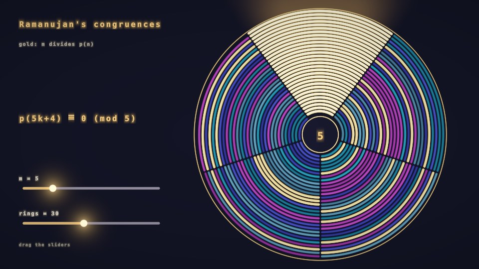

# Ramanujan's Congruences (interactive)

p(n) is laid on a spiral with **m** tiles per turn, so every residue class n mod m is a wedge.
Tiles glow gold where m divides p(n). At m = 5, 7, 11 one wedge is gold all the way out:
p(5k+4) ≡ 0 (mod 5), p(7k+5) ≡ 0 (mod 7), p(11k+6) ≡ 0 (mod 11). Drag the **m** slider through
fractional values to watch the spiral re-tune; it settles on a whole number when released.
**rings** sets how far out (up to n = 960) the spiral goes.

- **Common**: slider geometry and ranges.
- **Buffer A** (iChannel0 = itself, nearest): slider state (eased) and p(n) mod 720720 = lcm(1..16)
  for n < 1024, from Euler's pentagonal recurrence jumped 8 levels per frame (complete in 128 frames).
  Any m <= 16 is then a single `%`.
- **Image** (iChannel0 = Buffer A, nearest; iChannel1 = font texture `4dXGzr`): the window, sliders
  and a few fixed-width text lines (one font sample per line per pixel, strings packed 4 chars/uint).

`node tools/build.mjs` writes `ramanujan-congruences.json` and `viewer.html` (with a stand-in font atlas).
