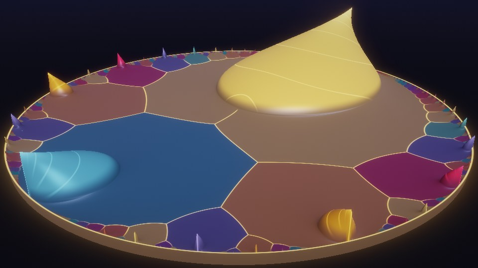

# Ramanujan: The Crown and the Edge (lite)

A trimmed, compile-friendly cut of movements III and IV of `../ramanujan-infinity`,
with no text: the circle-method crown over the unit disk, diving into an endless,
exactly self-similar modular zoom at the golden point. 46 s loop; drag to scrub.

 

- **Buffer A** (iChannel0 = itself, nearest): the scene. The clock is kept in the alpha of texel (0,0).
- **Image** (iChannel0 = Buffer A, mipmap): bloom from A's mip chain, ACES, vignette, dither.

Kept small for compile time: no Common, no arrays or text. The modular reduction is inlined
at only three call sites: the ray-march and its bisection share one loop, and the normal
and the zoom's three samples are loops too.

`node tools/build.mjs` writes `ramanujan-edge.json` and `viewer.html`.
