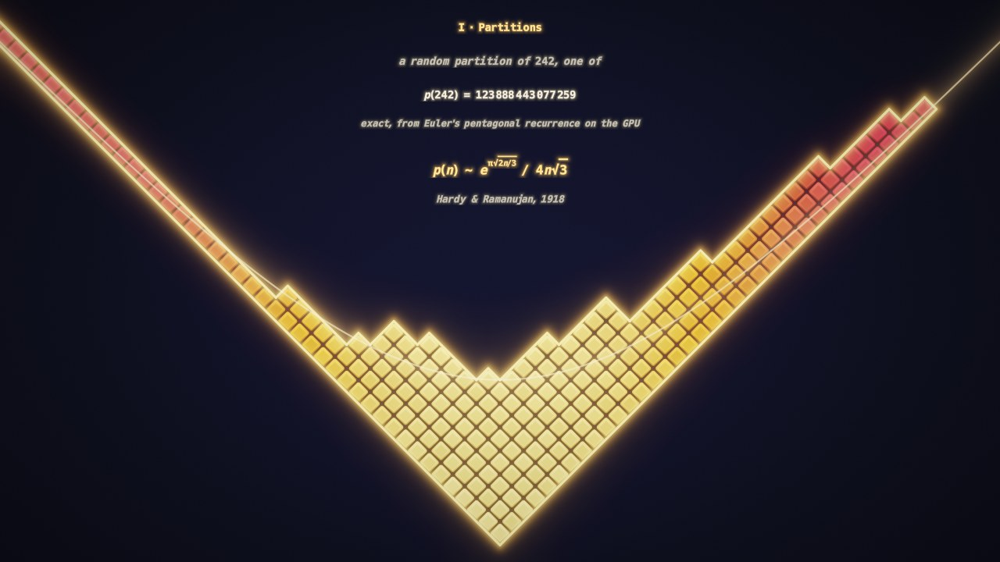
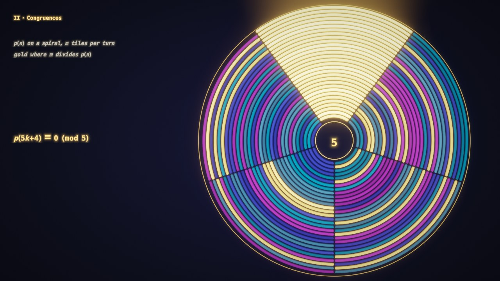
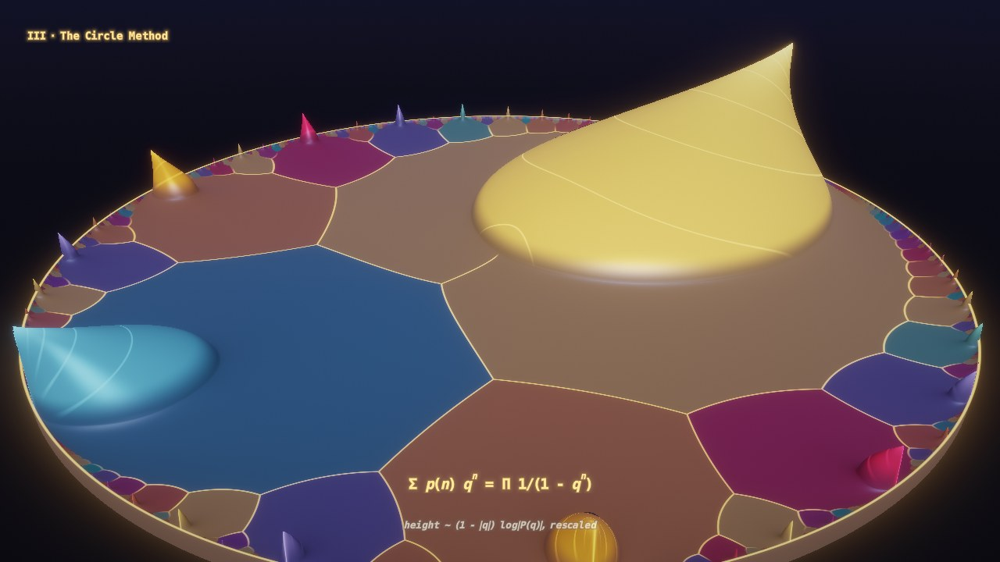
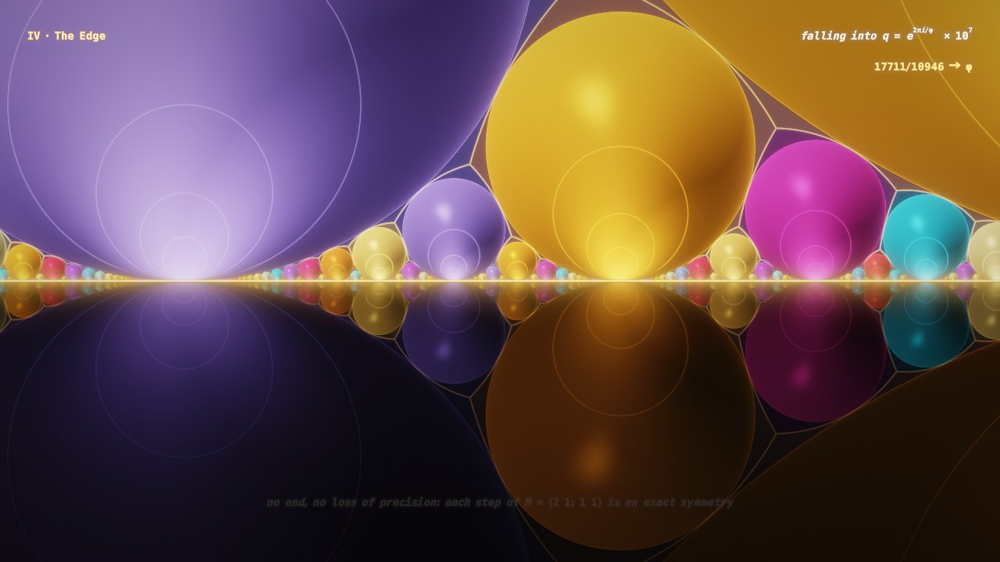
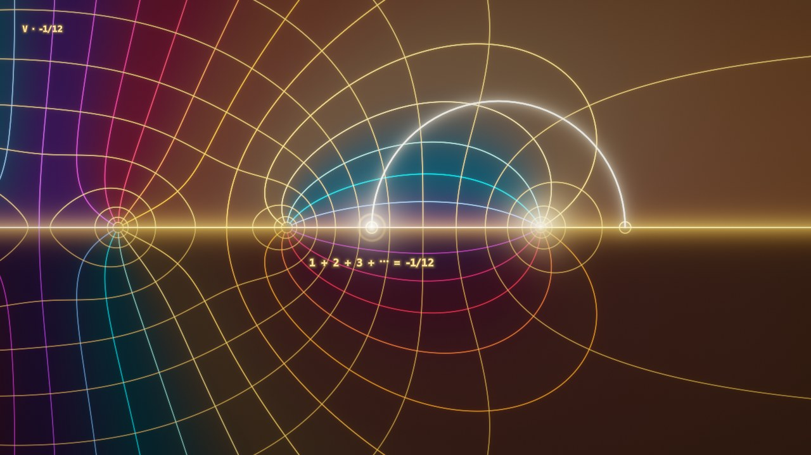
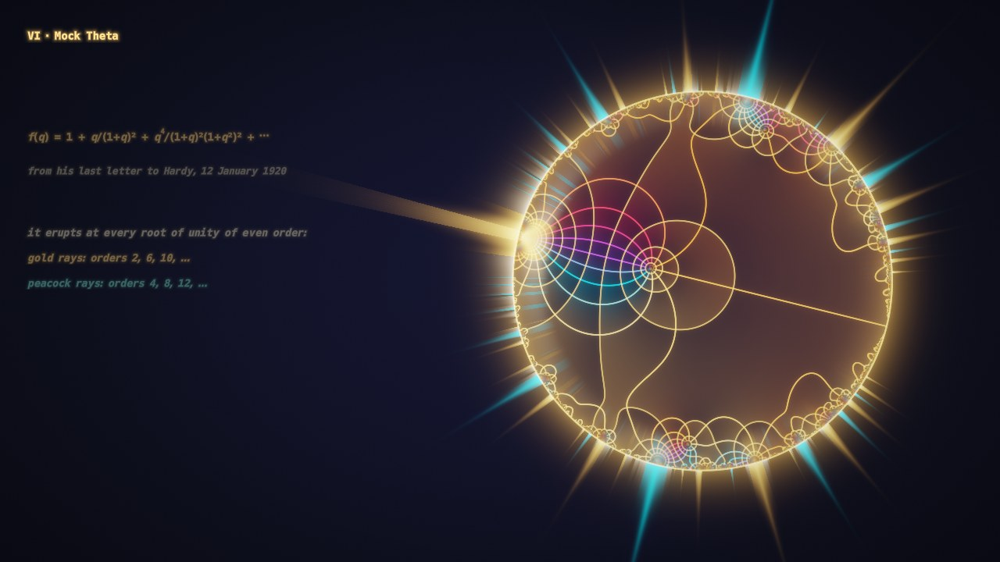

# Ramanujan: Notes from the Edge of Infinity

A multipass Shadertoy in six movements (132 s loop) on what I think are Ramanujan's
deepest insights about infinity. **Drag horizontally anywhere to scrub the timeline.**

| | |
|---|---|
|  |  |
|  |  |
|  |  |

1. **p(n): partitions.** The seven partitions of 5, then a random partition growing to ~60 000,
   drawn in Russian convention. The caption prints the **exact** p(N) (up to 47 digits),
   computed on the GPU in Buffer A from Euler's pentagonal number theorem (base-10⁴ bignums,
   recurrence jumped 8 levels per frame). Rescaled by √n the staircase freezes onto
   e^(−πx/√6)+e^(−πy/√6)=1, the geometric shadow of Hardy–Ramanujan's p(n) ~ e^(π√(2n/3))/(4n√3).
2. **Congruences.** p(n) laid on a spiral with m tiles per turn; tiles glow gold when m | p(n).
   As m is tuned through 5, 7, 11 one residue class locks into an unbroken golden wedge:
   p(5k+4)≡0 (mod 5), p(7k+5)≡0 (mod 7), p(11k+6)≡0 (mod 11). At 13 there is none.
3. **The circle method.** A 3D landscape of (1−|q|)·log|P(q)| over the unit disk,
   P(q)=Σp(n)qⁿ=∏(1−qⁿ)⁻¹, evaluated exactly at every ray step by reducing τ to the modular
   fundamental domain (P = q^(1/24)/η(τ)). Each root of unity e^(2πih/k) is a singularity whose
   peak rises to 1/k; the lobes are the Ford circles; the flat regions are coloured by their cusp.
4. **The edge.** The camera dives onto the golden boundary point e^(2πi/φ) and never stops:
   the zoom is done in the coordinate where M=(2 1;1 1) ∈ SL₂(Z) is an exact dilation, and
   everything drawn is modular-invariant, so the loop is seamless and never loses precision
   (magnification ×10ⁿ and the Fibonacci convergent are shown live).
5. **−1/12.** A phase portrait of ζ(s); a comet of analytic continuation runs around the pole
   from ζ(2)=π²/6 (the growth rate of p(n)) to ζ(−1)=−1/12 (the q in Δ(τ)=q∏(1−qⁿ)²⁴).
6. **Mock theta.** The third-order mock theta function f(q) from the 1920 last letter.
   Rays at the rim measure how fast it erupts at each root of unity (gold: order ≡2 mod 4,
   peacock: ≡0 mod 4). Morphing to f−b and f+b (b a theta function; computed without
   cancellation via Watson's identities f=A−2B, b=A+2B) erases one family, then the other:
   Ramanujan's claim that each singularity is mimicked by a theta function, but no single one
   mimics them all.

## Files

- `ramanujan-infinity.json`: the Shadertoy export (import with your bridge).
- `viewer.html`: standalone WebGL2 viewer with the JSON embedded; open it in a browser.
  It uses a local stand-in of the font atlas (`tools/font_standin.png`) since the real
  Shadertoy texture isn't bundled; on Shadertoy the real one (`4dXGzr`) is bound.
- `src/*.glsl`: pass sources. `tools/build.mjs` assembles them; `tools/gen_text.py` generates
  the caption token streams; `tools/render.mjs` renders frames headlessly.

```
python3 tools/gen_text.py && node tools/build.mjs
node tools/render.mjs --w 1280 --h 720 --warm 300 --t 80 --out shots/x
```

## Passes

| Pass | Inputs | Role |
|---|---|---|
| Common | – | timeline, palette, shared math and caption layout helpers |
| Buffer A | A (self), font | clock/scrub state, exact p(0..2047), random partition, caption tokens + glyph widths |
| Buffer B | A | the scene (HDR) |
| Buffer C | A, font | captions (SDF font, auto spacing, live numbers) |
| Buffer D | B (mipmap) | bloom from B's mip chain |
| Image | B, C, D, A | tone map, captions, vignette, grain, timeline bar while dragging |
