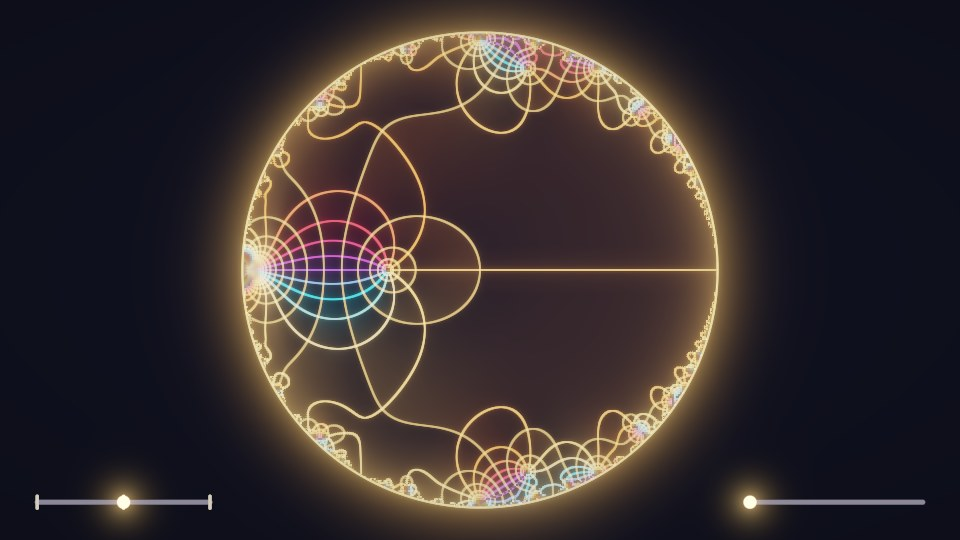

# Mock Theta Field Lines

 

Ramanujan's third-order mock theta function f(q) on the unit disk, as glowing field lines:
coloured where its phase is a multiple of 1/12 turn, gold where |f| doubles. It erupts at every
root of unity of even order; the lines pile up there into flowers, finer and finer along the rim.

- **Drag** to pan. **Bottom-right slider**: zoom (up to ×256, precise all the way; the series is
  renormalised as it grows, so the eruptions never overflow).
- **Bottom-left slider**: f + b · f · f − b. b(q) is a theta function; subtracting it calms the
  flowers at orders 4, 8, 12, … and adding it calms those at 2, 6, 10, … — never both.

Passes: **Buffer A** (self): eased UI state · **Buffer B** (A): the field lines in HDR, one series
evaluation per pixel with `fwidth` line widths · **Image** (A, B as mipmap): bloom, tone map, sliders.
