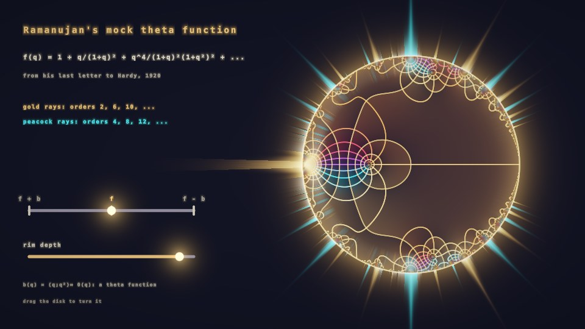

# Ramanujan's Mock Theta Function (interactive)

The third-order mock theta function f(q) from Ramanujan's last letter to Hardy (1920),
drawn as a phase portrait on the unit disk. Rays outside the rim show how fast it
erupts at each root of unity: gold for orders 2, 6, 10, …, peacock for 4, 8, 12, ….

- **morph slider**: f + b · f · f − b (snaps on release). b(q) is a theta function. Near every
  even-order root, f − (−1)^k b stays bounded (Ramanujan's claim), so f − b kills the peacock rays and
  f + b kills the gold ones. No single theta function kills both: that is what makes f *mock*.
  Computed without cancellation through Watson's identities f = A − 2B, b = A + 2B.
- **rim depth slider**: how close to the circle the eruption is measured (|q| = 0.95 … 0.996).
- **drag the disk** to turn it.

Passes: **Common** (slider geometry); **Buffer A** (iChannel0 = itself, nearest): eased UI state in
8 texels; **Image** (iChannel0 = Buffer A, nearest; iChannel1 = font texture `4dXGzr`): disk, rays,
sliders, fixed-width text. The q-series is inlined once (ray and gradient samples share a loop).

`node tools/build.mjs` writes `ramanujan-mocktheta.json` and `viewer.html`.
